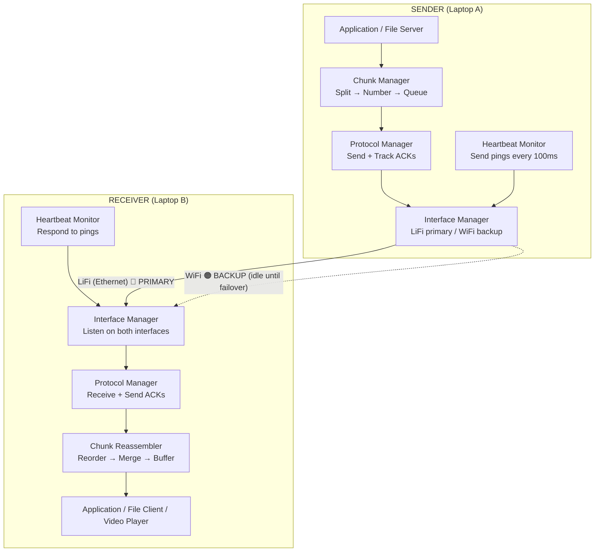
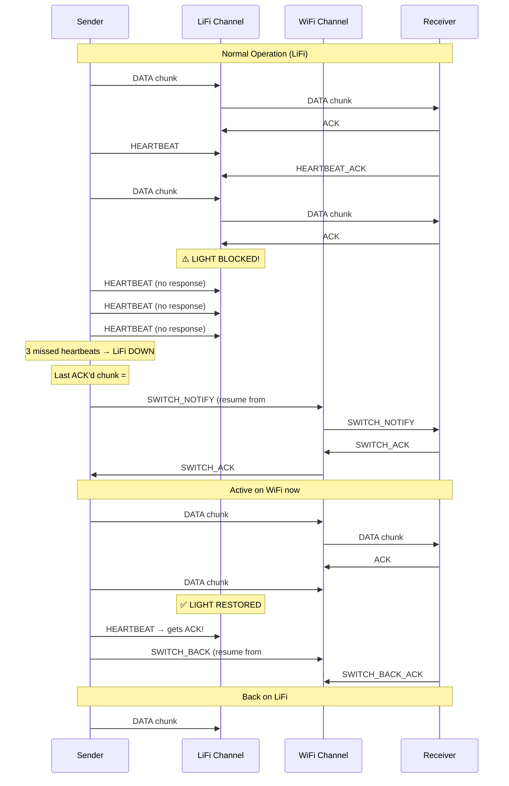

# LiFi ↔ WiFi Seamless Failover Protocol

Custom dual-interface communication system that transmits data over LiFi (Ethernet) as the primary channel and seamlessly fails over to WiFi when the light link breaks — and switches back when it recovers.

---

## Answers to Your Questions First

### Q1: How to check data rate through Ethernet (VLC)?

Three approaches, from simplest to most precise:

| Method | How | Pros | Cons |
|--------|-----|------|------|
| **OS interface stats** | `psutil.net_io_counters(pernic=True)['Ethernet']` — sample bytes_sent/recv every second | Zero overhead, works now | ~1s granularity |
| **Custom throughput measurement** | Time how long each chunk takes to ACK, compute `chunk_size / RTT` | Per-chunk granularity, built into our protocol | Slight overhead |
| **iperf3 baseline test** | Run `iperf3 -c <receiver_ip> -B <ethernet_ip>` once to characterize | Gold standard measurement | One-time test, not live |

**Recommendation**: Use OS interface stats for a live dashboard + per-chunk timing built into our protocol for real-time bandwidth awareness.

---

### Q2: How to detect if LiFi connection is alive?

Your three ideas + two more:

| Method | Detection Speed | Reliability | Notes |
|--------|----------------|-------------|-------|
| **i) Photodetector voltage < 0.03V** | **< 1ms** (fastest) | Very high | Requires hardware access (ADC/serial) to read voltage into software |
| **ii) Custom heartbeat packets** | **~100-300ms** | High | Send small UDP pings every 100ms, 3 misses = dead. Pure software, no hardware needed |
| **iii) Ethernet link state** | **~50-200ms** | High | OS reports link up/down via `psutil` or `socket.ioctl`. Free, but only catches full link loss, not degraded signal |
| **iv) RTT spike detection** | **~200ms** | Medium | If round-trip time of ACKs spikes 10x, link is degrading before it fully dies |
| **v) Dual-layer** | **< 100ms** | Highest | Combine link state (instant) + heartbeat (catches partial failures) |

**Recommendation**: Use **method (v) — dual layer**:
- Monitor Ethernet link state (catches cable/disconnect instantly)
- Send heartbeats every 100ms over LiFi (catches signal degradation)
- If either triggers → initiate failover

If you can access the photodetector voltage via serial/USB/ADC (e.g., Arduino reading the voltage and sending to the laptop), that's the ultimate fastest detection — we can integrate that too.

---

### Q3: Can data transmit via hotspot (without same WiFi)?

**Yes, absolutely!** Here are the options:

| Setup | Works? | How |
|-------|--------|-----|
| Same campus WiFi | ✅ Yes | Both get IPs on same subnet, direct communication |
| Laptop A hotspot → Laptop B connects | ✅ Yes | A gets 192.168.137.1, B gets 192.168.137.x — direct communication |
| WiFi Direct (ad-hoc) | ✅ Yes | P2P connection, no router needed, best for your use case |
| Different WiFi networks | ❌ No | NAT/firewall blocks direct communication (would need port forwarding or a relay server) |

**Recommendation**: Use **hotspot mode** — Laptop A creates hotspot, Laptop B connects. This is:
- Independent of campus WiFi (works anywhere)
- Low latency (direct, no router hops)
- Always available as backup

The WiFi channel stays connected but **idle** (no data flows) until failover is needed.

---

## Proposed Architecture

> [!IMPORTANT]
> This is NOT MPTCP. This is a custom application-layer protocol where WE control which interface carries data at any given moment. Only one interface is active for data at a time (energy efficient), but both are connected.

### High-Level Design



### Custom Packet Format

```
┌─────────────────────────────────────────────────────────┐
│                    PACKET HEADER (28 bytes)              │
├──────────┬──────────┬──────────┬──────────┬─────────────┤
│ Magic    │ Type     │ Seq No   │ Chunk ID │ Total       │
│ 0xLF01   │ 1 byte   │ 4 bytes  │ 4 bytes  │ Chunks      │
│ 2 bytes  │          │          │          │ 4 bytes     │
├──────────┬──────────┬──────────┴──────────┴─────────────┤
│ Interface│ Payload  │ Filename Hash                     │
│ ID       │ Length   │ 8 bytes                           │
│ 1 byte   │ 4 bytes  │                                   │
├──────────┴──────────┴───────────────────────────────────┤
│                    PAYLOAD (up to 60KB)                  │
├─────────────────────────────────────────────────────────┤
│                    CRC32 CHECKSUM (4 bytes)              │
└─────────────────────────────────────────────────────────┘
```

**Packet Types:**

| Type | Value | Direction | Purpose |
|------|-------|-----------|---------|
| `DATA` | 0x01 | S → R | File/stream chunk |
| `ACK` | 0x02 | R → S | Acknowledge received chunk |
| `HEARTBEAT` | 0x03 | S → R | LiFi link alive check |
| `HEARTBEAT_ACK` | 0x04 | R → S | LiFi link alive response |
| `SWITCH_NOTIFY` | 0x05 | S → R | "I'm switching to WiFi, resume from chunk X" |
| `SWITCH_ACK` | 0x06 | R → S | "OK, I'm ready on WiFi" |
| `SWITCH_BACK` | 0x07 | S → R | "LiFi recovered, switching back" |
| `SWITCH_BACK_ACK` | 0x08 | R → S | "OK, ready on LiFi again" |
| `FILE_META` | 0x09 | S → R | File name, size, total chunks |
| `TRANSFER_COMPLETE` | 0x0A | S → R | All chunks sent and ACK'd |

### Failover Flow (The Core Logic)



### Energy Efficiency

> [!TIP]
> Unlike MPTCP which would send data on both interfaces simultaneously, our protocol:
> - Keeps WiFi connected but **idle** (no data packets) during normal operation
> - Only heartbeats flow on LiFi as overhead (~100 bytes/sec)
> - WiFi activates **only** during failover
> - Switches back to LiFi as soon as it recovers (LiFi is faster + free in terms of RF spectrum)

---

## Proposed Changes

### Project Structure — `s:\projects\Temp\Fun\lifi-wifi-failover\`

```
lifi-wifi-failover/
├── protocol/
│   ├── __init__.py
│   ├── packet.py          # Packet class: build, parse, serialize, checksum
│   ├── constants.py       # Packet types, magic bytes, defaults
│   └── chunk_manager.py   # File → chunks, chunk → file reassembly
├── network/
│   ├── __init__.py
│   ├── interface_manager.py  # Discover, bind, monitor LiFi & WiFi interfaces
│   ├── heartbeat.py          # Heartbeat sender/responder threads
│   └── connection_monitor.py # Link state + heartbeat → connection status
├── sender/
│   ├── __init__.py
│   └── sender.py          # Main sender: chunk queue, send loop, failover logic
├── receiver/
│   ├── __init__.py
│   └── receiver.py        # Main receiver: listen, ACK, reassemble, buffer
├── utils/
│   ├── __init__.py
│   ├── logger.py           # Colored logging with timestamps
│   └── config.py           # Configuration (IPs, ports, thresholds, chunk size)
├── dashboard/
│   ├── index.html          # Live web dashboard showing transfer stats
│   ├── style.css
│   └── dashboard_server.py # WebSocket server pushing stats to browser
├── sender_main.py          # Entry point for sender
├── receiver_main.py        # Entry point for receiver
├── requirements.txt
└── README.md
```

All files are **[NEW]**.

---

### Component Details

#### [NEW] `protocol/packet.py`
- `Packet` dataclass with all header fields
- `pack()` → serialize to bytes with CRC32
- `unpack(data)` → deserialize + verify checksum
- Type-safe constants for packet types

#### [NEW] `protocol/chunk_manager.py`
- `FileChunker`: reads file, splits into numbered chunks (default 60KB each)
- `ChunkReassembler`: receives chunks (possibly out of order), reorders, writes to file
- Tracks which chunks are ACK'd, which need retransmission
- For streaming: provides a generator that yields chunks as they're reassembled

#### [NEW] `network/interface_manager.py`
- Auto-discovers Ethernet (LiFi) and WiFi interfaces using `psutil`
- Creates bound UDP sockets on each interface
- `get_lifi_socket()` / `get_wifi_socket()` / `get_active_socket()`
- Monitors link state changes

#### [NEW] `network/heartbeat.py`
- Sender side: sends `HEARTBEAT` every 100ms on LiFi, tracks ACKs
- Receiver side: responds with `HEARTBEAT_ACK`
- Reports: `is_alive()`, `rtt_ms()`, `missed_count()`

#### [NEW] `network/connection_monitor.py`
- Combines: link state + heartbeat status
- Fires callback when LiFi goes DOWN or comes back UP
- Configurable thresholds (missed heartbeats, voltage if available)

#### [NEW] `sender/sender.py`
- Main send loop: reads chunks from queue, sends over active interface
- Tracks `last_acked_chunk_id` — the critical state for failover
- On LiFi DOWN: sends `SWITCH_NOTIFY` over WiFi, waits for `SWITCH_ACK`, resumes
- On LiFi UP: sends `SWITCH_BACK`, waits for `SWITCH_BACK_ACK`, resumes on LiFi
- Windowed sending (send N chunks before waiting for ACKs) for throughput

#### [NEW] `receiver/receiver.py`
- Listens on both LiFi and WiFi sockets (using `select()`)
- Processes incoming packets, sends ACKs
- On `SWITCH_NOTIFY`: starts accepting data from WiFi
- `ChunkReassembler` buffers and reorders
- Exposes received data as a stream (for video) or writes to file

#### [NEW] `dashboard/` (Web Dashboard)
- Real-time visualization: active interface, throughput, chunks transferred, failover events
- WebSocket-based, auto-updates
- Shows: current interface (LiFi 🔵 / WiFi 🟠), bandwidth chart, latency, chunk progress

---

## Open Questions

> [!IMPORTANT]
> **Q1: Interface IP Configuration**
> I need to know your network setup:
> - What is the Ethernet (LiFi) IP of Sender? (e.g., `192.168.1.x`)
> - What is the Ethernet (LiFi) IP of Receiver?
> - Will you use Hotspot or same WiFi for the backup channel?
> - For WiFi, will the IPs be auto-assigned (DHCP)?
>
> For now, I'll make these configurable in a `config.py` file so you just fill in your IPs.

> [!IMPORTANT]
> **Q2: Photodetector Hardware Access**
> Can you read the photodetector voltage from software? For example:
> - Is there an Arduino/microcontroller reading the photodetector that connects via USB serial?
> - Or does the Velmenni device expose any API/status?
>
> If no — that's fine, we'll use heartbeat + link state detection (works great, just ~200ms slower than hardware detection).

> [!IMPORTANT]
> **Q3: Use Case Priority**
> Which use case is your primary focus?
> - **a) File transfer** — send complete files from folder A to folder B
> - **b) Video streaming** — stream a video in real-time for playback
> - **c) Both** — we'll support both modes
>
> This affects buffering strategy and chunk size optimization.

> [!IMPORTANT]
> **Q4: Language Preference**
> I'm planning Python (with `asyncio` for performance) since it works on both Windows laptops easily. Are you okay with Python, or do you prefer something else (C/C++ for lower latency, etc.)?

---

## Verification Plan

### Automated Tests
1. **Unit tests**: Packet serialization/deserialization, chunk splitting/reassembly
2. **Simulated failover test**: Run sender + receiver on same machine using loopback interfaces, simulate link drop
3. **Throughput benchmark**: Measure chunks/sec on each interface

### Manual Verification (with your LiFi setup)
1. Start sender + receiver on both laptops
2. Transfer a large file (~1GB) over LiFi → verify integrity (hash match)
3. Block the light mid-transfer → observe:
   - Dashboard shows switch to WiFi
   - Transfer continues without data loss
   - Video (if streaming) buffers briefly then resumes
4. Unblock the light → observe switch back to LiFi
5. Measure total failover time (target: < 500ms)

---

## What's Better About This Plan vs Your Original

Your original 5 points are all included. Here's what's added:

| Your Plan | This Plan Adds |
|-----------|---------------|
| Dual-interface | Auto-discovery of interfaces, no hardcoded names |
| Custom chunking + ACK | **Windowed sending** (send N chunks before waiting for ACKs → much higher throughput) |
| Connection monitoring | **Dual-layer** detection (link state + heartbeat) for fastest failover |
| Failover switching | **Bidirectional signaling** (SWITCH_NOTIFY/ACK) so both sides are always in sync |
| Buffering + smoothing | **Pre-established WiFi channel** (always connected, zero setup time on failover) + **adaptive chunk sizing** based on measured bandwidth |
| — | **Switch-back** logic: automatically returns to LiFi when light recovers |
| — | **Live web dashboard** for monitoring and demos |
| — | **File integrity** verification (CRC32 per chunk + full file hash) |
